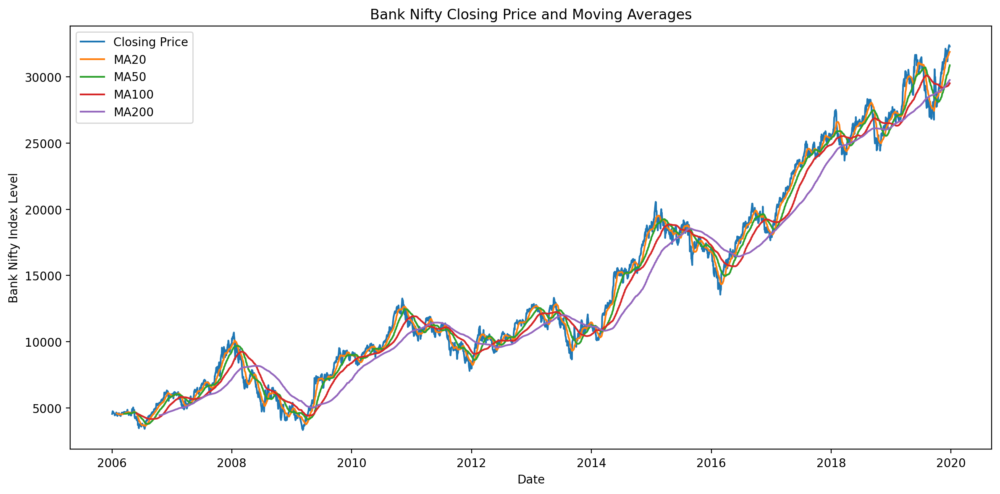
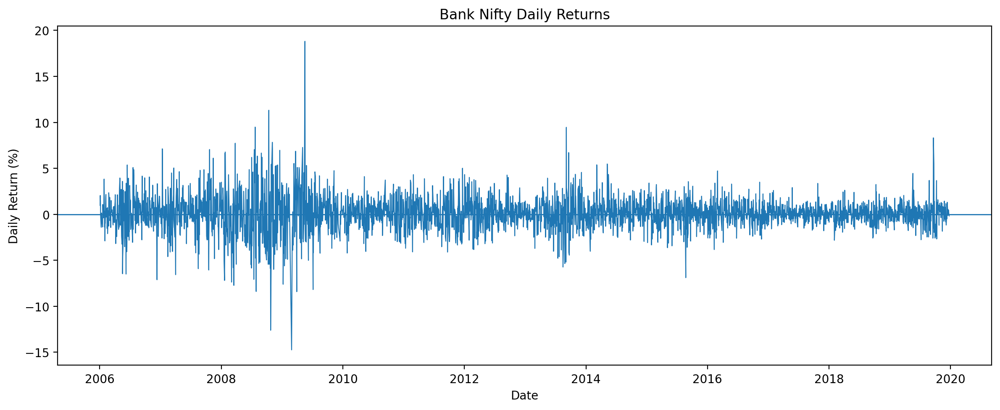
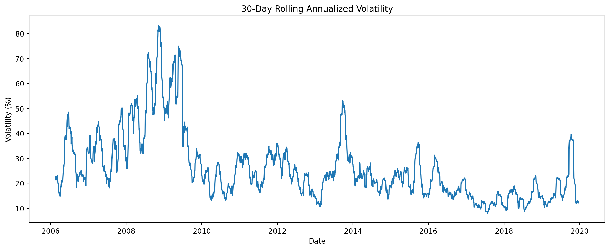
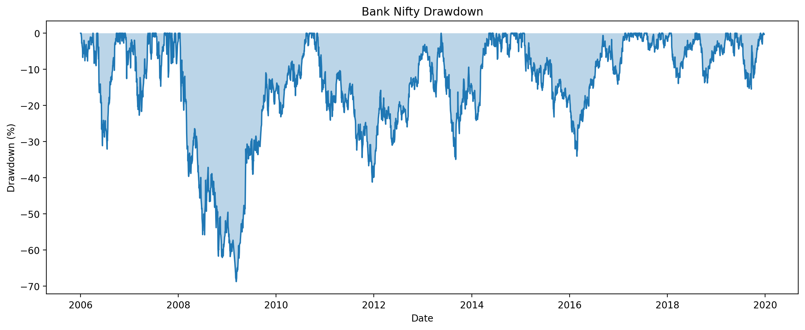
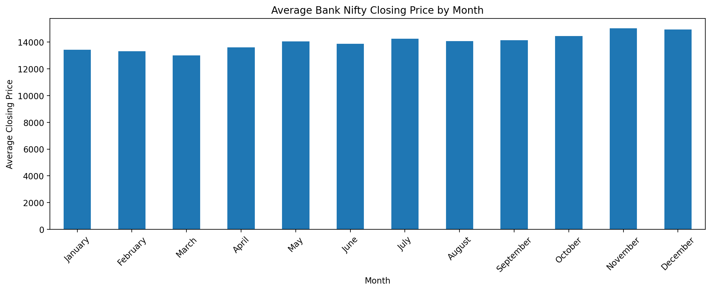
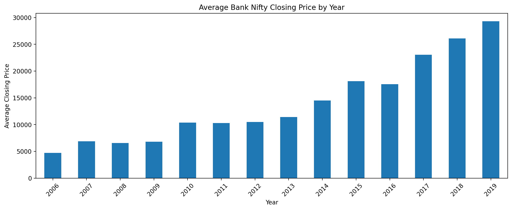
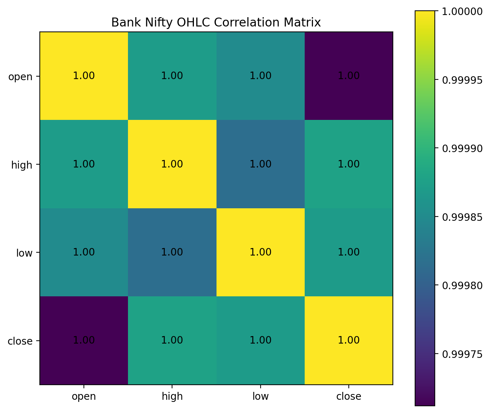
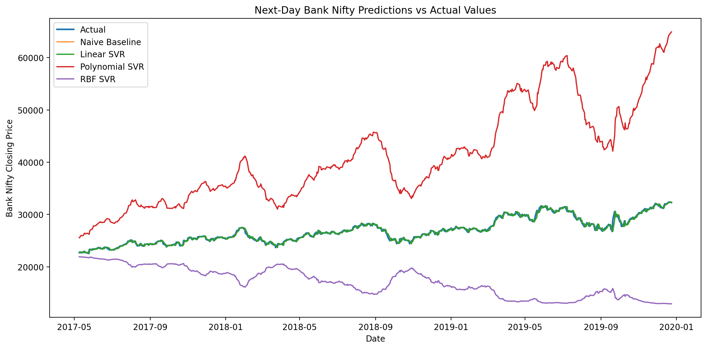

# Bank Nifty Market Analytics

A Python-based data analytics project exploring the historical performance, trends, risk, volatility, and short-term price behavior of the Bank Nifty index.

## Project Overview

This project focuses primarily on data analytics and visualization, with a small machine learning component for short-term price prediction.

The analysis covers historical Bank Nifty data from 2006 to 2019 and examines price trends, daily returns, moving averages, volatility, drawdowns, monthly and yearly performance, and relationships between market variables.

## Key Analysis

- Dataset exploration and data cleaning
- Descriptive statistics
- Closing price analysis
- Daily return analysis
- 20, 50, 100 and 200-day moving averages
- Rolling volatility analysis
- Drawdown analysis
- Monthly and yearly performance
- Correlation analysis
- Risk and return metrics
- Best and worst trading days

## Machine Learning

A lightweight Support Vector Regression (SVR) component was added to complement the analytics.

Three SVR models were compared:

- Linear SVR
- Polynomial SVR
- RBF SVR

A naive baseline was also included for comparison.

The models were evaluated using:

- Mean Absolute Error (MAE)
- Root Mean Squared Error (RMSE)
- R² Score

The ML component is intended as an exploratory forecasting exercise rather than a production trading model.

## Key Findings

The historical analysis showed:

- Total return of approximately 608%
- Annualized return of approximately 15%
- Annualized volatility of approximately 29%
- Maximum drawdown of approximately -69%
- Positive returns on approximately 53% of trading days

The Linear SVR performed substantially better than the nonlinear SVR models on this dataset.

## Visualizations

### Price & Moving Averages



### Daily Returns



### Rolling Volatility



### Drawdown Analysis



### Monthly Average Closing Price



### Yearly Average Closing Price



### Correlation Analysis



### Model Predictions



## Project Structure

```text
bank-nifty-market-analytics/
│
├── data/
│   └── banknifty.csv
│
├── images/
│   ├── 01_price_moving_averages.png
│   ├── 02_daily_returns.png
│   ├── 03_rolling_volatility.png
│   ├── 04_drawdown.png
│   ├── 05_monthly_average_close.png
│   ├── 06_yearly_average_close.png
│   ├── 07_correlation_heatmap.png
│   └── 08_predictions_vs_actual.png
│
├── report/
│   ├── model_comparison.csv
│   ├── monthly_performance.csv
│   ├── predictions.csv
│   ├── svr_predictions.csv
│   └── yearly_performance.csv
│
├── src/
│   ├── analytics.py
│   ├── main.py
│   ├── prediction.py
│   └── visualizations.py
│
└── requirements.txt
